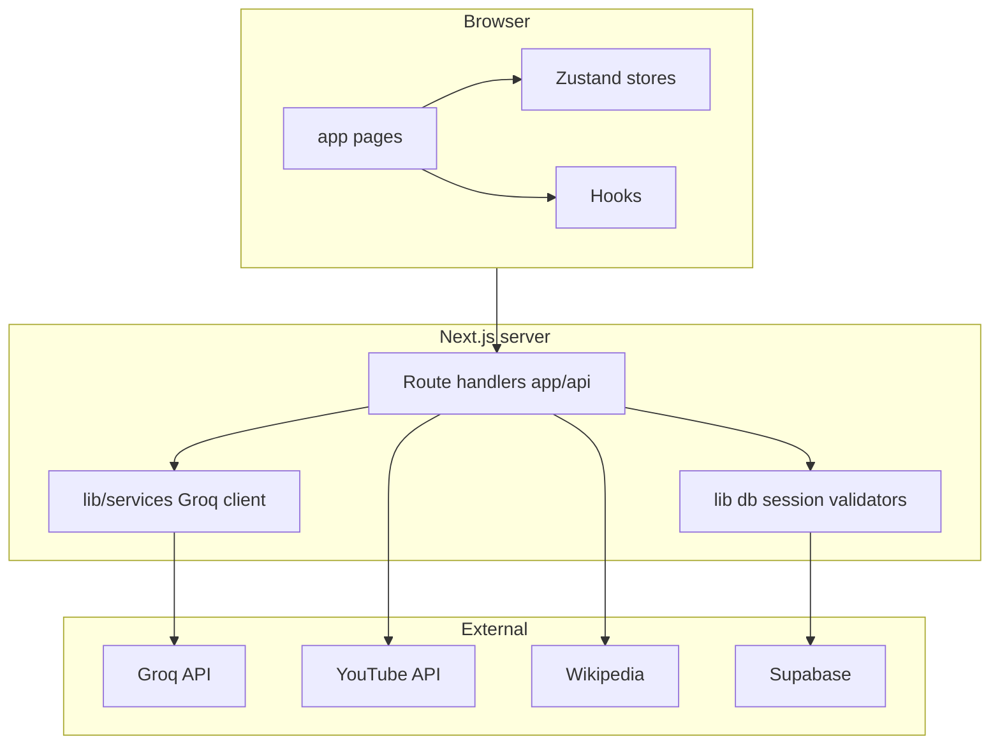

# Knack

Knack is a web app for **focused hobby learning**: you pick a hobby and level, get an AI-built roadmap of **5–8 techniques**, then work through **videos, reading, and practice tasks** while tracking progress (mastered / skipped) and a simple streak. Data is tied to an anonymous **session** and persisted in **Supabase** so it survives refresh and return visits—no signup required.

## Tech stack

| Layer        | Choice                                                          |
| ------------ | --------------------------------------------------------------- |
| Framework    | Next.js 16 (App Router), React 19, TypeScript                   |
| Styling      | Tailwind CSS 4, shadcn-style UI components                      |
| Client state | Zustand                                                         |
| Validation   | Zod                                                             |
| Persistence  | Supabase (PostgreSQL)                                           |
| AI           | Groq (`llama-3.3-70b-versatile`) for plans and markdown lessons |
| Media        | YouTube Data API, Wikipedia API, Pexels (optional images)       |

## Architecture



- **`lib/services/`** — thin integration boundaries (e.g. `GroqClientService`) so environment and SDK setup stay consistent across routes.
- **`lib/db.ts`** — maps domain types to Supabase rows (plans, techniques, sessions, streaks).
- **`app/api/*`** — JSON APIs: plan generation, content generation, video fetch, technique updates, sessions.

## Getting started

```bash
cp .env.example .env.local
# Fill in keys (see below)
npm install
npm run dev
```

Open [http://localhost:3000](http://localhost:3000).

### Environment variables

| Variable                    | Required | Purpose                                  |
| --------------------------- | -------- | ---------------------------------------- |
| `GROQ_API_KEY`              | Yes      | Plan and article-style technique content |
| `YOUTUBE_API_KEY`           | Yes      | Search/embed-friendly tutorial videos    |
| `SUPABASE_URL`              | Yes      | Database URL                             |
| `SUPABASE_SERVICE_ROLE_KEY` | Yes      | Server-side access from API routes       |
| `PEXELS_API_KEY`            | No       | Fallback stock imagery for techniques    |

### Supabase schema

Tables expected by the app: **`sessions`**, **`plans`**, **`techniques`**, **`streaks`**. Column names align with the inserts/updates in [`lib/db.ts`](lib/db.ts) (snake_case in the database, camelCase in TypeScript types). Create matching tables and RLS/policies for your environment before relying on production data.

## Scripts

| Command             | Description                |
| ------------------- | -------------------------- |
| `npm run dev`       | Development server         |
| `npm run build`     | Production build           |
| `npm run start`     | Run production build       |
| `npm run lint`      | ESLint                     |
| `npm run format`    | Prettier write             |
| `npm run typecheck` | TypeScript check           |
| `npm test`          | Vitest (validators, utils) |

**Git hooks (Husky):** `pre-commit` runs **lint-staged** (ESLint + Prettier on staged files); `pre-push` runs **`typecheck`** and **`test`**.

## Testing

Focused **unit tests** cover high-value, deterministic code: Zod schemas in [`lib/validators.ts`](lib/validators.ts) and helpers in [`lib/utils.ts`](lib/utils.ts). Run `npm test` before pushing.

## AI usage (assistive, not “vibe coded”)

Groq is used **only** to propose structured learning plans and long-form markdown lessons from prompts defined in code ([`lib/ai.ts`](lib/ai.ts), [`app/api/generate-content/route.ts`](app/api/generate-content/route.ts)). Shapes are validated with Zod before persistence. Architecture, data model, APIs, UI, and integration choices are authored and reviewed as normal application code.

## Design and product inspiration

- Assignment references for product direction: [oboe.fyi](https://oboe.fyi), [wondering.app](https://wondering.app) (ideas only—not a clone).
- UI built with patterns from **[shadcn/ui](https://ui.shadcn.com)** and registry components; decorative effects from **[Aceternity UI](https://ui.aceternity.com)** (see [`components.json`](components.json)).

## Deployment (e.g. Vercel)

1. Connect the repo and set the same environment variables as `.env.example`.
2. Ensure Supabase is reachable from Vercel’s region.
3. `npm run build` must pass locally first.

## Git workflow

Development used short-lived branches merged into `main`, for example:

- `chore/tooling` — Prettier, Husky, lint-staged
- `chore/deps-config` — dependencies and Next/Tailwind config
- `feat/domain-api` — types, `lib/`, API routes
- `feat/ui` — components, stores, hooks, pages
- `test/core` — Vitest
- `docs/readme` — this document

After creating a **GitHub** repository, add the remote and push:

```bash
git remote add origin https://github.com/<you>/<repo>.git
git push -u origin main
git push origin --tags
```

## License

Private / assignment use—adjust as needed.
