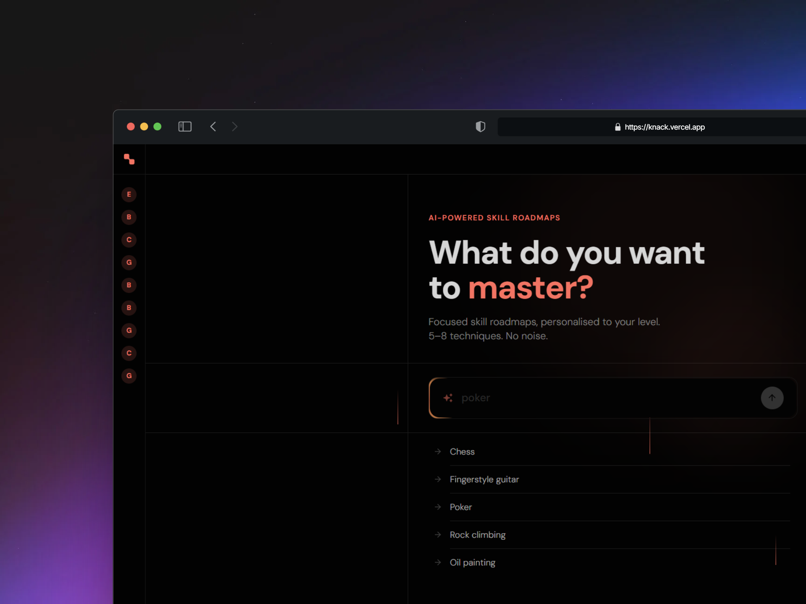
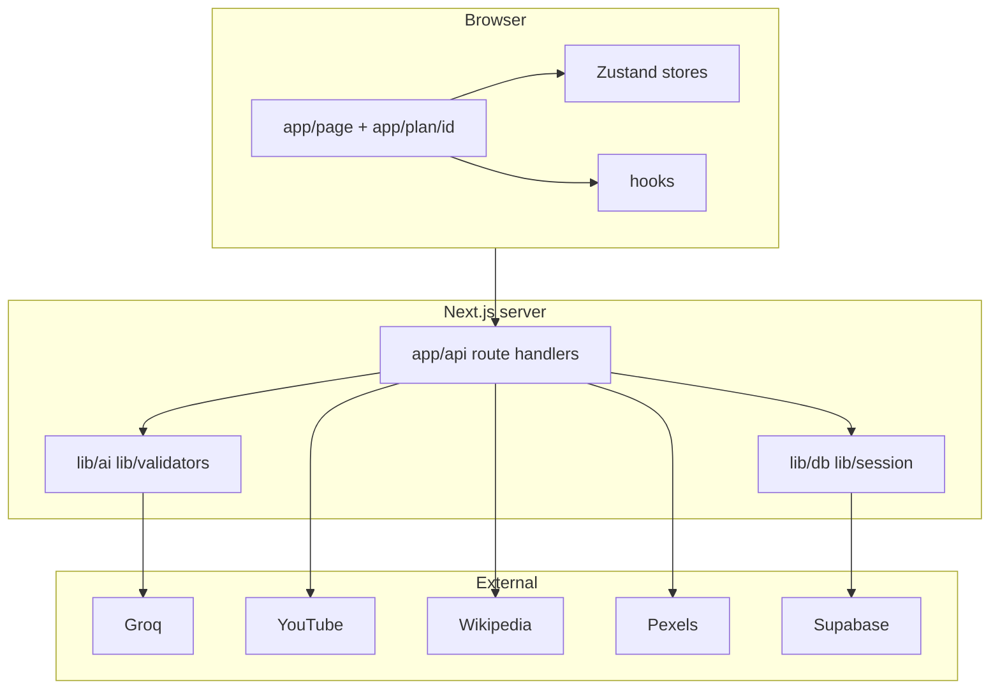
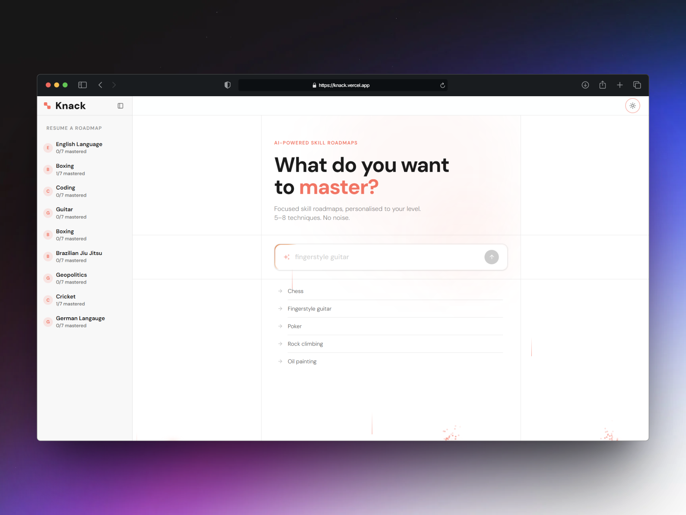

# Knack



Knack is a web app for **focused hobby learning**: you complete a short **preference quiz** (visual style, learning mode, session length), choose a **hobby** and **current → target** skill level, then get an AI-built roadmap of **5–8 techniques**. You work through **videos**, **reading** (markdown with GitHub-flavored markdown and **Mermaid** diagrams where useful), **Wikipedia** context images, optional **stock hero images** (Pexels), **practice tasks**, and an in-context **technique chat**. Progress is **mastered / skipped**, with a **daily streak** and **resume** behaviour so you pick up where you left off.

Plans and progress are tied to an anonymous **browser session** and persisted in **Supabase**—no signup required.

## Tech stack

| Layer        | Choice                                                                                                                                                                   |
| ------------ | ------------------------------------------------------------------------------------------------------------------------------------------------------------------------ |
| Framework    | Next.js 16 (App Router), React 19, TypeScript                                                                                                                            |
| Styling      | Tailwind CSS 4, shadcn-style UI (`components/ui`, `components.json`)                                                                                                     |
| Client state | Zustand (`store/planStore`, `store/uiStore`)                                                                                                                             |
| Validation   | Zod                                                                                                                                                                      |
| Persistence  | Supabase (PostgreSQL) via `lib/db.ts`, `lib/supabase.ts`                                                                                                                 |
| AI           | Groq (`llama-3.3-70b-versatile`) — plans, MDX lessons, chat; optional **second API key** for quota fallback ([`lib/groqWithKeyFallback.ts`](lib/groqWithKeyFallback.ts)) |
| Media        | YouTube Data API (`lib/youtube.ts`), Wikipedia (`lib/wikipedia.ts`), Pexels (`app/api/generate-image`)                                                                   |

Groq calls for plans, MDX, and chat go through [`lib/groqWithKeyFallback.ts`](lib/groqWithKeyFallback.ts): the primary `GROQ_API_KEY` is used first; if Groq returns rate limits or transient errors, the same request is retried once with `GROQ_API_KEY_FALLBACK` when set (separate Groq project key, same API).

## Architecture



- **`app/page.tsx`** — onboarding: quiz → hobby → levels → plan generation; resume and past-plan UI.
- **`app/plan/[id]/page.tsx`** — loads plan from Supabase, renders **`PlanView`**.
- **`app/api/*`** — JSON APIs (see table below).
- **`lib/db.ts`** — maps domain types to Supabase rows (sessions, plans, techniques, streaks).
- **`lib/resumeState.ts`** — local resume pointer (plan + technique) for the home experience.



## API routes

| Route                        | Role                                                                                      |
| ---------------------------- | ----------------------------------------------------------------------------------------- |
| `POST /api/generate-plan`    | Groq (+ optional fallback key): structured plan from hobby, levels, preferences           |
| `POST /api/generate-content` | Groq (+ optional fallback key): per-technique MDX lesson content                          |
| `POST /api/generate-image`   | Pexels search → hero image URL (503 if `PEXELS_API_KEY` unset)                            |
| `POST /api/fetch-videos`     | YouTube search, Shorts filtered via duration                                              |
| `GET /api/wikipedia`         | Wikipedia summary image for a query                                                       |
| `POST /api/sessions`         | List plans for a session id                                                               |
| `GET /api/plan/[id]`         | Plan JSON by id (SSR uses `getPlanById` directly; route available for clients or tooling) |
| `PATCH /api/technique/[id]`  | Partial technique updates (notes, videos, images, mdx, etc.)                              |
| `POST /api/technique-chat`   | Groq (+ optional fallback key): Q&A in context of a technique                             |

## Getting started

```bash
cp .env.example .env.local
# Set variables (see table below). Never commit .env.local or real API keys.
npm install
npm run dev
```

Open [http://localhost:3000](http://localhost:3000). If you use **pnpm**, `pnpm install` / `pnpm run dev` work the same (`pnpm-lock.yaml` is present alongside `package-lock.json`).

### Environment variables

| Variable                    | Required | Purpose                                                                                                   |
| --------------------------- | -------- | --------------------------------------------------------------------------------------------------------- |
| `GROQ_API_KEY`              | Yes      | Primary Groq key: plans, markdown content, technique chat                                                 |
| `GROQ_API_KEY_FALLBACK`     | No       | Second Groq key (separate quota); used on 429 / transient 5xx / connection errors from the primary key    |
| `YOUTUBE_API_KEY`           | Yes      | Tutorial video search                                                                                     |
| `SUPABASE_URL`              | Yes      | Database URL                                                                                              |
| `SUPABASE_SERVICE_ROLE_KEY` | Yes      | Server-side writes from API routes                                                                        |
| `PEXELS_API_KEY`            | No       | Stock hero images for techniques (skipped for diagram/flowchart image styles when unset or misconfigured) |

### Supabase schema

The app expects **`sessions`**, **`plans`**, **`techniques`**, and **`streaks`** tables aligned with inserts/updates in [`lib/db.ts`](lib/db.ts) (snake_case in the database, camelCase in [`types/index.ts`](types/index.ts)). Configure RLS and policies for your environment before production use.

## Scripts

| Command                | Description                     |
| ---------------------- | ------------------------------- |
| `npm run dev`          | Next.js dev server              |
| `npm run build`        | Production build                |
| `npm run start`        | Run production server           |
| `npm run lint`         | ESLint                          |
| `npm run format`       | Prettier (write)                |
| `npm run format:check` | Prettier (check only)           |
| `npm run typecheck`    | `tsc --noEmit`                  |
| `npm test`             | Vitest (single run)             |
| `npm run test:watch`   | Vitest watch mode               |
| `npm run healthcheck`  | Lint + typecheck + test + build |

**Git hooks (Husky):** `pre-commit` runs **lint-staged** (ESLint fix + Prettier on staged files); `pre-push` runs **`typecheck`** and **`test`**.

## Testing

Vitest runs `**/*.test.ts` in a Node environment with `@` → repo root ([`vitest.config.ts`](vitest.config.ts)). Current coverage is **unit-level, deterministic `lib/` helpers** only:

- [`lib/validators.test.ts`](lib/validators.test.ts) — Zod plan/content shapes
- [`lib/utils.test.ts`](lib/utils.test.ts)
- [`lib/storage.test.ts`](lib/storage.test.ts)
- [`lib/resumeState.test.ts`](lib/resumeState.test.ts)
- [`lib/mdxSanitize.test.ts`](lib/mdxSanitize.test.ts)
- [`lib/mermaidNormalize.test.ts`](lib/mermaidNormalize.test.ts)

There are no automated tests for `app/api/*`, pages, components, hooks, or stores yet; add them when you want regression safety on integrations or UI.

## Repository layout

| Area          | Contents                                                                                                           |
| ------------- | ------------------------------------------------------------------------------------------------------------------ |
| `app/`        | App Router: `layout.tsx`, home `page.tsx`, `plan/[id]/page.tsx`, `api/**/route.ts`                                 |
| `components/` | Onboarding, plan shell, technique UI, layout, `ui/` primitives                                                     |
| `hooks/`      | Video search, streak, technique actions/notes, etc.                                                                |
| `store/`      | Zustand plan + UI state                                                                                            |
| `lib/`        | DB, AI, Groq key fallback (`groqWithKeyFallback.ts`), YouTube, Wikipedia, session, sanitization, validators, utils |
| `constants/`  | App name, endpoints, model id, limits                                                                              |
| `types/`      | Shared TypeScript domain types                                                                                     |
| `public/`     | Static assets including branding shots                                                                             |

## AI usage

Groq produces **structured JSON plans** and **long-form markdown** from prompts in [`lib/ai.ts`](lib/ai.ts) and [`app/api/generate-content/route.ts`](app/api/generate-content/route.ts). Configure a **fallback Groq API key** (`GROQ_API_KEY_FALLBACK`) so rate-limited or failing primary-key requests automatically retry on a second Groq account ([`lib/groqWithKeyFallback.ts`](lib/groqWithKeyFallback.ts)). Responses are validated with **Zod** (`lib/validators.ts`) before persistence.

## Design and product inspiration

- Product direction references: [oboe.fyi](https://oboe.fyi), [wondering.app](https://wondering.app) (ideas only—not a clone).
- UI patterns from **[shadcn/ui](https://ui.shadcn.com)** and registry components; decorative effects from **[Aceternity UI](https://ui.aceternity.com)** (see [`components.json`](components.json)).

## Deployment (e.g. Vercel)

1. Connect the repo and set the same variables as `.env.example` in the host dashboard.
2. Ensure Supabase is reachable from the deployment region.
3. Run `npm run healthcheck` (or at least `npm run build`) locally before shipping.

## Git workflow

Short-lived feature branches merged to `main` are typical (tooling, API, UI, tests, docs). After creating a remote:

```bash
git remote add origin https://github.com/<you>/<repo>.git
git push -u origin main
```

## License

Private / assignment use—adjust as needed.
